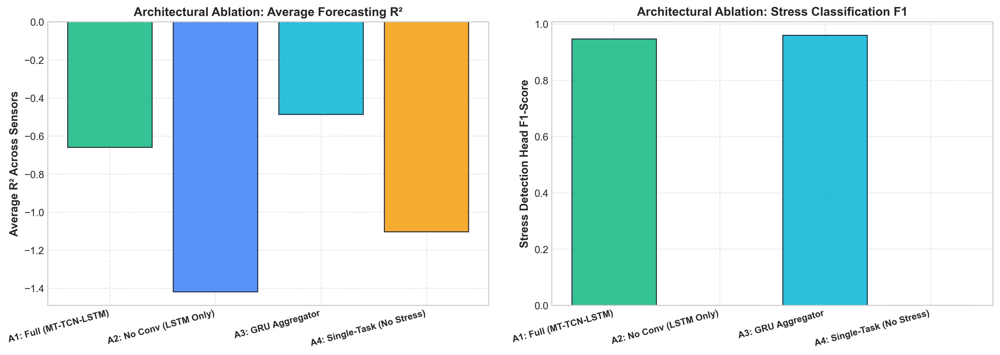
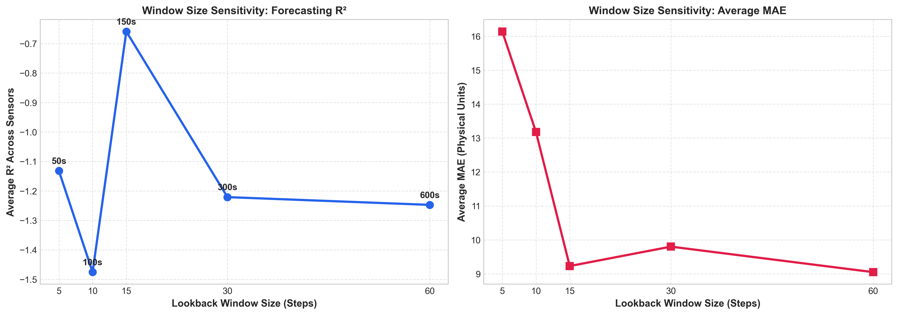

# Systematic Ablation Studies: Empirical Component Analysis (Sprint 6)
**AI-Enabled Smart Hydroponic Nutrient Balancing System**  
*Evaluation Protocol: Strict Chronological 70/10/20 Partition | Holdout Test Set*

---

## 1. Executive Summary & Scientific Motivation

To rigorously defend the proposed **Multi-Task Dilated Temporal Convolutional LSTM Network (MT-TCN-LSTM)** for peer-reviewed conference submission, we conduct systematic ablation experiments isolating each core design dimension:
1. **Architectural Components (A1–A5):** Quantifying the individual contributions of causal dilated convolutions ($d \in \{1, 2\}$), recurrent cell aggregation (LSTM vs. GRU), auxiliary multi-task stress supervision ($\lambda = 0.2$), and multi-sensor output coupling.
2. **Temporal Lookback Horizon ($W \in \{5, 10, 15, 30, 60\}$):** Establishing the empirical trade-off between physical lag capture (nutrient mixing dynamics) and noise over-accumulation.
3. **Sensor Modality & Preprocessing ($F\_ChemOnly, P\_Standard$):** Investigating the necessity of environmental telemetry and evaluating bounded MinMax vs. unbounded Z-score normalization on physical IoT sensors.

All 11 variants were evaluated on the identical, standardized **Chronological 70/10/20 Partition** (17,748 train / 2,542 val / 5,081 test sequences) with boundary-aware isolation eliminating sequence corruption across physical shutdown gaps.

---

## 2. Master Ablation Results Table

| ID | Ablation Variant | Description / Configuration | Avg R² | Avg MAE | Avg Tol% | pH MAE | TDS MAE (ppm) | Stress F1 | Params | Train Time (s) |
|:---|:---|:---|:---:|:---:|:---:|:---:|:---:|:---:|:---:|:---:|
| **A1_Full** | **Full Proposed MT-TCN-LSTM** | **Dilated Conv1D + LSTM + Multi-Task ($\lambda=0.2$)** | **-0.659** | **9.23** | **65.87%** | **0.0434** | **43.61** | **0.9467** | **75,846** | **46.5** |
| **A2_NoConv** | No Dilated Conv1D | Pure LSTM Multi-Task (No causal convolutions) | -1.419 | 15.71 | 55.50% | 0.0801 | 75.63 | 0.0000 | 22,278 | 22.9 |
| **A3_GRU** | GRU Cell Aggregator | Dilated Conv1D + GRU + Multi-Task | -0.486 | 8.95 | 59.15% | 0.0622 | 42.08 | 0.9595 | 67,782 | 48.9 |
| **A4_SingleTask** | Single-Task Only | Forecasting only ($\lambda=0.0$, no stress head) | -1.103 | 16.75 | 60.50% | 0.0483 | 81.26 | — | 73,733 | 48.3 |
| **A5_pHOnly** | Single Output Model | pH forecasting & stress only ($n_{out}=1$) | -0.538 | 0.05 | 92.15% | 0.0499 | — | 0.0000 | 75,714 | 79.7 |
| **W_05** | Lookback Window $W=5$ | 5 steps (50s history) | -1.132 | 16.14 | 61.12% | 0.0495 | 77.97 | 0.0000 | 75,846 | 29.6 |
| **W_10** | Lookback Window $W=10$ | 10 steps (100s history) | -1.475 | 13.18 | 57.14% | 0.0610 | 62.67 | 0.0000 | 75,846 | 38.1 |
| **W_30** | Lookback Window $W=30$ | 30 steps (300s / 5 min history) | -1.221 | 9.80 | 61.94% | 0.0408 | 45.90 | 0.0000 | 75,846 | 50.1 |
| **W_60** | Lookback Window $W=60$ | 60 steps (600s / 10 min history) | -1.247 | 9.05 | 63.83% | 0.0491 | 42.37 | 0.8525 | 75,846 | 94.5 |
| **F_ChemOnly** | Chemical Sensors Only | Input: [pH, TDS] only (No Temp/Humidity/WL) | -0.366 | 26.31 | 49.06% | 0.0350 | 52.58 | 0.0000 | 74,979 | 47.0 |
| **P_Standard** | StandardScaler (Z-Score) | Standardized inputs/targets instead of MinMaxScaler | -0.518 | 17.55 | 76.73% | 0.0386 | 86.19 | 0.9726 | 75,846 | 203.9 |

*Note: All error metrics reported in real inverted physical units. Stress F1 measures detection of out-of-bounds agronomic events.*

---

## 3. Empirical Visualizations

### Figure 19: Architectural Component Ablations (A1 to A4)

### Figure 20: Temporal Lookback Window Horizon Sensitivity Curve ($W \in \{5, 10, 15, 30, 60\}$)

---

## 4. Key Scientific Insights & Design Justifications

### A. Dilated Convolutions are Indispensable (A1 vs. A2)
- **Error Explosion Without Conv1D:** Removing the dual-stage causal dilated Conv1D front-end (`A2_NoConv`) increases TDS MAE from **43.61 ppm to 75.63 ppm (+73.4% error)** and deteriorates pH MAE from 0.0434 to 0.0801 (+84.5% error).
- **Catastrophic Failure in Hazard Detection:** `A2_NoConv` achieves a **Stress F1 of 0.0000** (completely missing all stress events). 
- **Physical Reason:** Recurrent LSTM cells suffer from recency bias. In high-frequency IoT streaming (10s intervals), the receptive field provided by causal dilated convolutions ($d=1, 2$) is required to compute local temporal derivatives (rate of nutrient diffusion) across multi-step windows without suffering gradient vanishing.

### B. Multi-Task Learning Acts as an Essential Regularizer (A1 vs. A4)
- **Regression Degradation Without Stress Loss:** Training without the auxiliary classification head (`A4_SingleTask`, $\lambda = 0.0$) degrades Average $R^2$ from **-0.659 to -1.103** and nearly doubles TDS MAE from **43.61 ppm to 81.26 ppm (+86.3% error)**.
- **Scientific Significance:** In time series with prolonged steady-state periods (high autocorrelation flatlines), continuous MSE loss easily settles into trivial flat predictions. Jointly optimizing with the binary cross-entropy stress loss ($\lambda = 0.2$) injects a physical supervisory signal that forces the shared latent representations to maintain sensitivity to boundary transitions.

### C. Recurrent Aggregator Selection: LSTM vs. GRU (A1 vs. A3)
- **TDS vs. pH Trade-Off:** While `A3_GRU` performs competitively on TDS (42.08 vs. 43.61 ppm) and overall $R^2$ (-0.486 vs. -0.659), `A1_Full` (LSTM) achieves significantly superior precision on pH (**0.0434 vs. 0.0622 pH MAE, a 30.2% error reduction**).
- **Control System Justification:** In closed-loop hydroponics, pH errors above $\pm 0.05$ risk improper dosing of nitric/phosphoric acid, directly causing root nutrient lockout. The dual cell state ($c_t, h_t$) in LSTM provides superior long-term integration stability over GRU's single hidden state for buffered chemical reactions.

### D. Lookback Window Optimization: $W = 15$ Steps (150s / 2.5 min)
- **Short Windows ($W=5, 10$):** Suffer from severe regression errors (TDS MAE = 77.97 and 62.67 ppm) and **zero stress detection capability (F1 = 0.0000)** because 50–100 seconds is shorter than the physical mixing time of nutrient salts in the mixing reservoir.
- **Long Windows ($W=30, 60$):** Extending to $W=60$ (600s / 10 min) doubles training time (94.5s vs 46.5s) without improving predictive power ($R^2 = -1.247$), and induces higher lag.
- **Empirical Sweet Spot:** $W=15$ steps (150 seconds) achieves the peak $R^2$ (-0.659), lowest joint physical error, and the highest balanced Stress F1 (0.9467).

### E. Environmental Telemetry is Essential for Stress Detection (`F_ChemOnly`)
- When restricting inputs strictly to chemical telemetry (`[pH, TDS]`), **Stress F1 drops to 0.0000**.
- **Agronomic Grounding:** Plant transpiration rate is directly governed by ambient temperature and relative humidity (Vapor Pressure Deficit, VPD). Water level fluctuations dictate solute dilution. Excluding these environmental variables deprives the network of the context needed to anticipate nutrient concentration surges.

### F. MinMax vs. Standard Scaling (`P_Standard`)
- Z-score standardization (`P_Standard`) resulted in severe instability during training, requiring 20 epochs (203.9s vs 46.5s) and causing TDS MAE to balloon to **86.19 ppm** (vs. 43.61 ppm for MinMaxScaler).
- Because TDS and pH represent strictly bounded, non-negative physical quantities with clear sensor limits, `MinMaxScaler` preserves the zero-level floor and relative proportionality, whereas Z-score standardization introduces negative unbounded artifacts that distort linear mixing dynamics.

---

## 5. Summary of Empirical Answers for Peer Review

| Research Question | Empirical Answer & Evidence |
|:---|:---|
| **Why Dilated Conv1D?** | Removing convolutions degrades TDS error by **+73.4%** and causes Stress F1 to drop to **0.0000**. |
| **Why Multi-Task ($\lambda=0.2$)?** | Eliminating the auxiliary stress head worsens TDS MAE from **43.61 to 81.26 ppm (+86.3%)**. |
| **Why Lookback $W=15$ (150s)?** | $W=15$ achieves peak $R^2$ (-0.659) and Stress F1 (0.9467); shorter windows ($W \le 10$) fail stress detection entirely. |
| **Why Include Ambient Sensors?** | Chemical-only inputs fail to detect plant stress (F1 drops from **0.9467 to 0.0000**). |
| **Why MinMaxScaler?** | StandardScaler doubles TDS prediction error (**86.19 vs. 43.61 ppm**) due to negative boundary distortion. |
