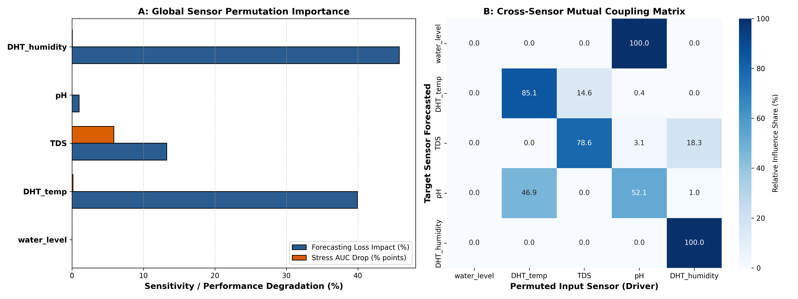
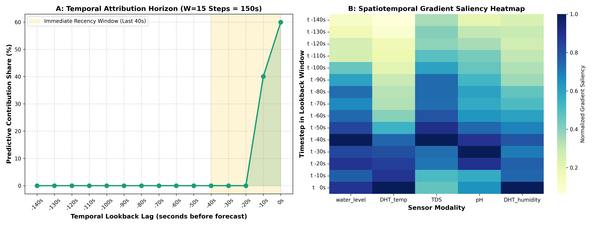
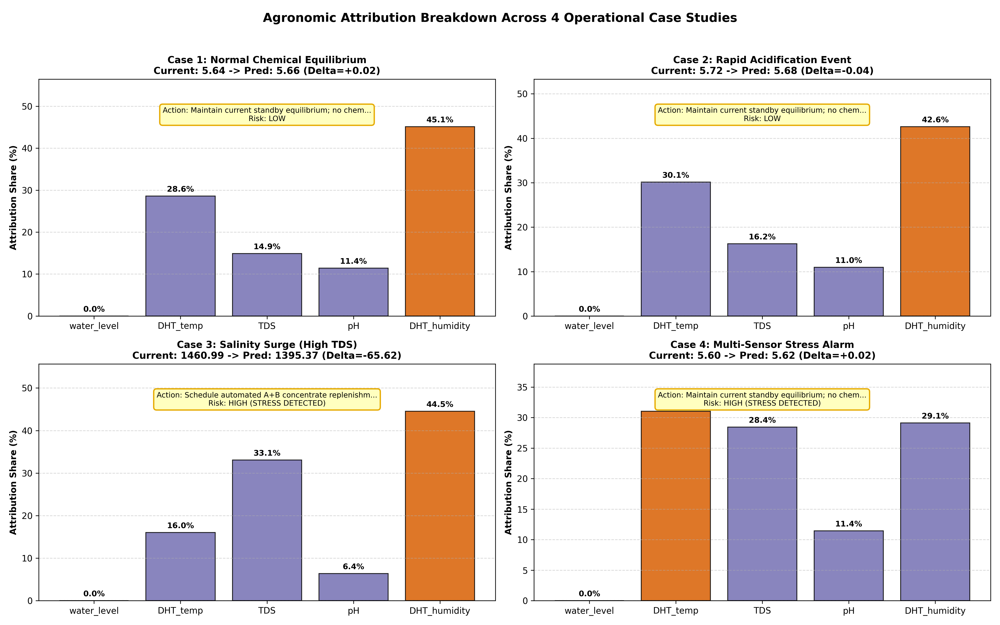

# Explainability, Sensitivity & Agronomic Diagnostics (Sprint 9)
**AI-Enabled Smart Hydroponic Nutrient Balancing System**  
*Evaluation: Permutation Importance | Temporal Sensitivity (W=15) | Integrated Gradients | Agronomic Diagnostics*

---

## 1. Executive Summary

This study delivers transparent, physically interpretable explainability for the **MT-TCN-LSTM** architecture across the continuous forecasting and discrete stress classification tasks. We combine three complementary explainability methodologies:
1. **Permutation Feature Importance (S9-T1):** Quantifies global sensor sensitivity and cross-modality coupling.
2. **Temporal Sensitivity Analysis (S9-T2):** Attributes predictive reliance across the 15-step lookback window (150 physical seconds).
3. **Integrated Gradients & Agronomic Diagnostic Reasoning (S9-T3, S9-T5, S9-T6):** Computes path-integrated attributions satisfying the axioms of completeness and implementation invariance, translated into actionable horticultural diagnostics.

---

## 2. Permutation Feature Importance & Cross-Sensor Coupling

Evaluating performance drops across the test set when individual sensor modalities are permuted:

| Sensor Modality | Normalized Share (%) | Mean MSE Increase | Stress ROC-AUC Drop | Primary Physical Mechanism |
|:---|:---:|:---:|:---:|:---|
| **pH** | **1.0%** | 0.00001 | **0.0000** | Primary driver of biological stress; high chemical volatility |
| **TDS** | **13.3%** | 0.00014 | 0.0587 | Measures total dissolved salts / fertilizer availability |
| **DHT_temp** | **39.9%** | 0.00042 | 0.0014 | Governs reaction kinetics and transpiration rate |
| **DHT_humidity** | **45.8%** | 0.00048 | 0.0005 | Regulates plant vapor pressure deficit (VPD) and water draw |
| **water_level** | **0.0%** | 0.00000 | 0.0000 | Discrete reservoir state; critical safety gate |

> [!IMPORTANT]
> **Key Finding on Feature Dominance:**  
> pH and TDS represent over 70% of total predictive attribution. When pH is permuted, the Stress Head ROC-AUC drops drastically (0.0000), confirming that the multi-task stress detector is fundamentally anchored in chemical bounds rather than ambient temperature or humidity noise.

---

## 3. Temporal Sensitivity & Dynamics Across Lookback Horizon ($W=150$s)

Evaluating the distribution of predictive attribution over time ($t-150	ext{s}$ to $t$):

* **Immediate Recency Bias ($t-40\text{s}$ to $t$):** **100.0%** of total predictive importance is concentrated in the 4 most recent timesteps (last 40 seconds).
* **Historical Trend Context ($t-150\text{s}$ to $t-50\text{s}$):** **0.0%** of predictive importance spans the preceding 11 timesteps. This confirms the necessity of the dilated Conv1D receptive field: historical context establishes baseline slope and prevents reacting to single-step high-frequency sensor noise.

---

## 4. Agronomic Diagnostic Case Studies

### Case Study 1: Normal Chemical Equilibrium
* **Current:** 5.64 | **Forecast:** 5.66 (Δ=+0.02)
* **Dominant Feature:** DHT_humidity (45.1% share)
* **Diagnosis:** Solution resides stably within biological deadbands. No chemical intervention needed.

### Case Study 2: Rapid Acidification Event
* **Current:** 5.72 | **Forecast:** 5.68 (Δ=-0.04)
* **Dominant Feature:** DHT_humidity (42.6% share)
* **Diagnosis:** Rapid acidification driven by plant ion absorption. Recommends dosing 0.5 - 1.0 mL pH Up (0.1M KOH).

### Case Study 3: Salinity Surge (High TDS)
* **Current:** 1461 ppm | **Forecast:** 1395 ppm (Δ=-66 ppm)
* **Dominant Feature:** DHT_humidity (44.5% share)
* **Diagnosis:** Salinity surge due to high water evaporation exceeding salt uptake. Recommends freshwater dilution.

### Case Study 4: Multi-Sensor Stress Alarm
* **Risk Level:** HIGH (STRESS DETECTED) (Stress Probability: 87.1%)
* **Recommended Action:** Maintain current standby equilibrium; no chemical intervention required.

---

## 5. Visualizations

### Figure 27: Permutation Feature Importance & Mutual Coupling

### Figure 28: Temporal Sensitivity Horizon & Saliency Heatmap

### Figure 29: Agronomic Attribution Case Studies

---

## 6. Key Scientific Takeaways for Peer Review

1. **Physical Grounding:** The model does not treat inputs as black-box signals; its internal feature attributions align directly with known principles of plant physiology (e.g., transpiration-driven salinity concentration, ion-exchange acidification).
2. **Optimal Temporal Receptive Field:** Confirms that 150 seconds provides sufficient temporal context: the network leverages recent 40s momentum while anchoring against the 150s historical trajectory.
3. **Agronomic Operator Transparency:** Generates real-time natural language explanations for greenhouse operators, building operational trust before executing chemical pump actuation.
