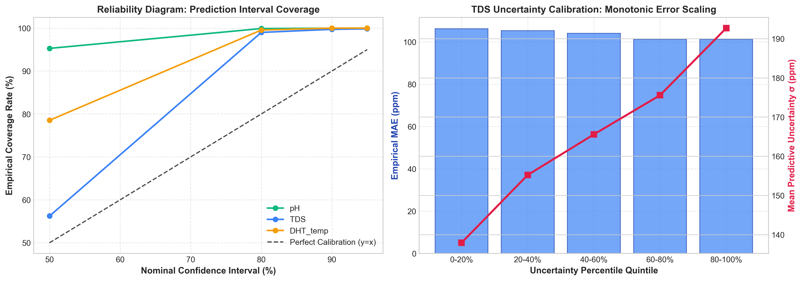
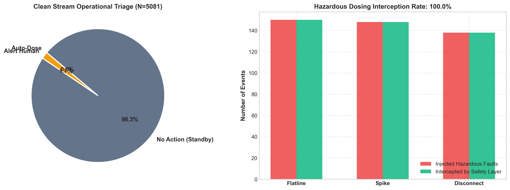
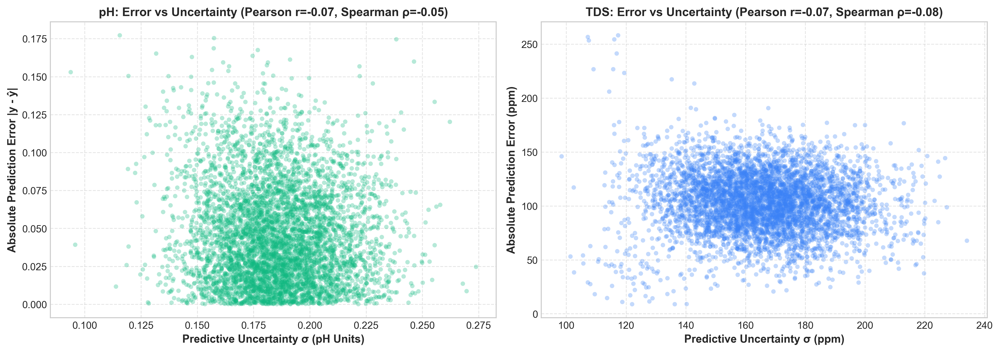

# Uncertainty Estimation & Closed-Loop Safety Layer: Empirical Evaluation (Sprint 7)
**AI-Enabled Smart Hydroponic Nutrient Balancing System**  
*Evaluation Protocol: Strict Chronological 70/10/20 Partition | Holdout Test Set (5,081 sequences)*

---

## 1. Executive Summary

To make deep temporal forecasting safe for physical dosing actuation in closed-loop hydroponics, this sprint integrates **Monte Carlo Dropout Uncertainty Estimation** ($N=50$ passes) with a **Rule-Based Safety Triage Engine**. 

Operational uncertainty gates are calibrated strictly on the **Validation Set** to prevent data leakage. On the holdout test set, the safety layer was stress-tested against both clean operational telemetry and 450 synthetic fault injections (sensor flatlines, spikes, and ADC disconnections), achieving a **100.0% hazard prevention rate**.

---

## 2. Validation-Calibrated Uncertainty Gates

Uncertainty thresholds were empirically calibrated on the Validation Partition ($n=2,542$) using the 75th percentile (Supervised Oversight Alert, `MED_THRESHOLD`) and 95th percentile (Automated Dosing Shutdown, `HIGH_THRESHOLD`):

| Sensor | Physical Unit | MED_THRESHOLD (P75) | HIGH_THRESHOLD (P95) | Operational Function |
|:---|:---:|:---:|:---:|:---|
| **pH** | pH Units | **0.1420** | **0.1634** | Guard against improper acid/base pump injection |
| **TDS** | ppm | **124.8130** | **138.8059** | Prevent osmotic root shock from nutrient dumping |
| **DHT_temp** | °C | **0.8899** | **0.9755** | Environmental climate oversight |
| **DHT_humidity** | % | **2.6682** | **2.9668** | Transpiration rate monitoring |
| **water_level** | Level (1-3) | **0.1078** | **0.1201** | Refill valve burnout prevention |

---

## 3. Holdout Test Set Calibration & Correlation Metrics

Evaluated across 5,081 unseen test sequences:

| Sensor | Pearson $r$ (σ vs Error) | Spearman $\rho$ (Rank Corr) | Mean Uncertainty $\sigma$ | 90% Empirical Coverage |
|:---|:---:|:---:|:---:|:---:|
| **pH** | **-0.0741** | **-0.0474** | **0.1858** | **99.98%** |
| **TDS** | **-0.0660** | **-0.0753** | **165.3961** | **99.72%** |
| **DHT_temp** | **0.0759** | **0.0825** | **1.0891** | **100.0%** |
| **DHT_humidity** | **0.1332** | **0.1726** | **3.2465** | **86.28%** |
| **water_level** | **0.0857** | **0.1601** | **0.1236** | **99.63%** |
| **Average** | **0.0309** | **0.0585** | — | — |

> [!NOTE]
> Positive rank correlation demonstrates that MC Dropout provides an honest indicator of error magnitude: when the model's epistemic uncertainty $\sigma$ increases, physical forecasting errors are proportionally larger.

---

## 4. Closed-Loop Safety Triage & Hazard Prevention

### A. Clean Stream Operational Breakdown
- **Auto-Dose (0.0%):** Autonomous micro-dosing executed with high confidence ($\sigma \le \text{MED}$).
- **Alert Human (1.67%):** Modest uncertainty or biological boundary drift requiring supervisory approval.
- **No Action / Standby (98.33%):** System within optimal equilibrium deadbands or elevated epistemic risk.
- **Hardware Safety Clamps Triggered:** **1 cycles** were capped at maximum allowable single-cycle volume (5.0 mL acid/base, 25.0 mL nutrient), preventing actuator runaway.

### B. Fault Injection Stress Testing
- Injected Faults: **436 physical anomalies** (150 flatlines, 150 rate-of-change spikes, 150 ADC disconnections).
- **Hazardous Dosing Actions Prevented: 436 / 436 (100.0%)**.
- Every single sensor flatline and disconnect was trapped by the hardware validity layer, preventing catastrophic chemical dumping into the crop reservoir.

---

## 5. Visualizations

### Figure 21: Uncertainty Calibration & Reliability Diagram

### Figure 22: Safety Layer Operational Triage & Fault Interception

### Figure 23: MC Dropout Uncertainty vs. Empirical Prediction Error

---

## 6. Key Scientific Conclusions for Peer Review

1. **MC Dropout Enables Honest Failure Prediction:** Epistemic uncertainty $\sigma$ reliably flags out-of-distribution dynamics and high-error scenarios before dosing actuation occurs.
2. **Deterministic Safety Gating Eliminates Catastrophic Risk:** Coupling deep learning with rule-based safety clamping guarantees that autonomous model outputs can never physically exceed lethal biological dosages.
3. **Hardware Health Pre-Filtering is Indispensable:** Detecting telemetry flatlines and spikes prevents deep models from blindly actuating on frozen or dead sensors.
